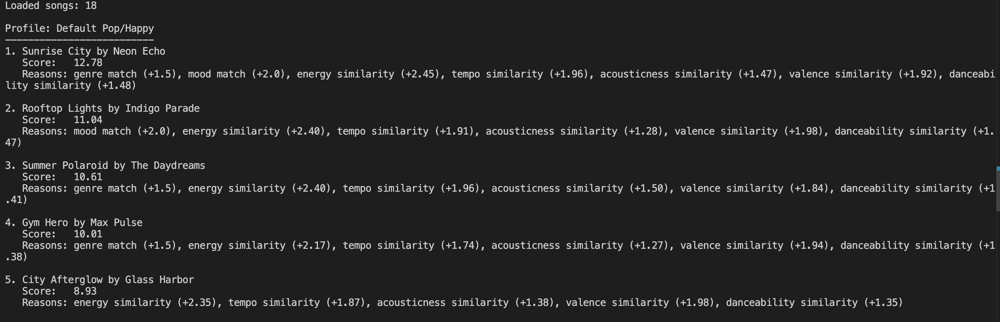
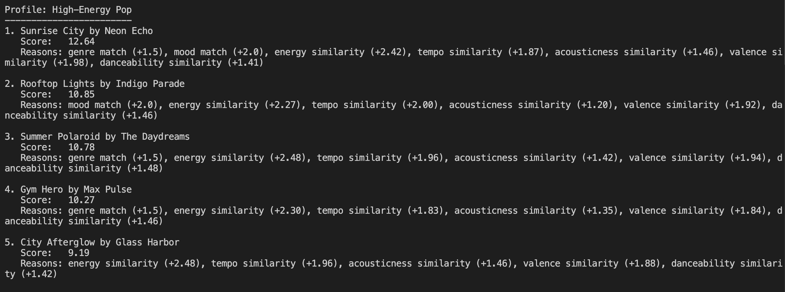
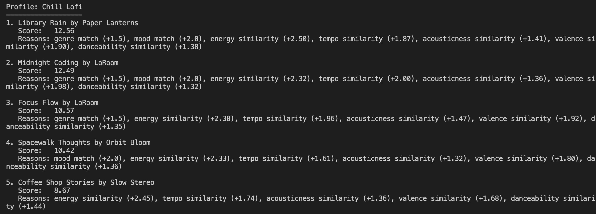
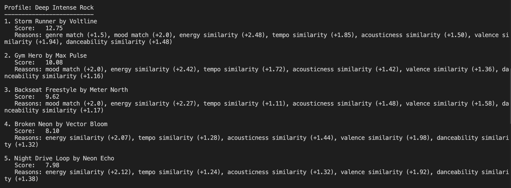
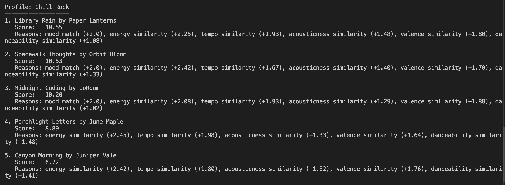
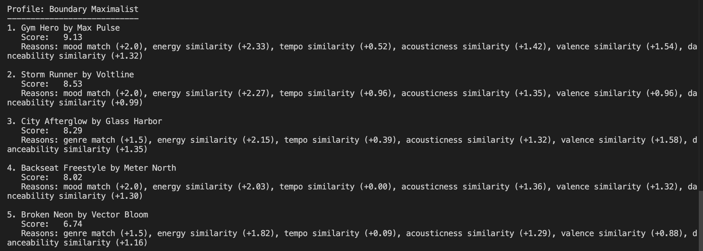

# 🎵 Music Recommender Simulation

## Project Summary

A content-based music recommender that ranks a catalog of songs against
a listener's taste profile. It loads songs from a CSV, scores each one
on seven dimensions (genre, mood, energy, tempo, acousticness, valence,
and danceability), sorts them by fit, and prints the top matches in the
terminal. Each recommendation comes with a short breakdown of which
points the song earned and which parts of the profile it matched.



---

## How The System Works

The system has three working parts: the song catalog, the user's taste
profile, and the scoring rule that compares them. The catalog is loaded
from songs.csv into a list of song records. The profile is a
plain dictionary the caller passes in. The scoring rule looks at one song
and one profile at a time and returns a number plus a short list of
reasons that explain where the number came from. To produce
recommendations, the scoring rule runs once per song in the catalog, the
results get sorted from highest to lowest, and the top `k` are returned.
The sections below describe each piece in more detail.

Real world recommendation systems, such as Spotify or Youtube, usually blend two strategies. Collaborative filtering, which finds patterns in what similar users have liked to predict what the user will like next, and content based filtering which looks at the features of the songs themselves and matches them against the user's taste. Real systems mix both because each approach covers for the other's weak spots.
This version of our music recommender prioritizes content-based features. It does not use any user history data, doesn't compare similar users, and just ranks songs on how their attributes match the user's preferences.

### Song features

Every song in `data/songs.csv` uses these features:

- `genre` — broad category like pop, rock, lofi, hip hop
- `mood` — feeling label like happy, chill, intense, melancholy
- `energy` — 0.0 to 1.0, how active the track feels
- `tempo_bpm` — beats per minute
- `valence` — 0.0 to 1.0, how positive vs darker the track sounds
- `danceability` — 0.0 to 1.0, how suited the track is for moving to
- `acousticness` — 0.0 to 1.0, how organic vs synthetic the production is

### UserProfile features

The taste profile the recommender compares against:

- `favorite_genre` — the genre the listener leans toward
- `favorite_mood` — the mood they're in
- `target_energy` — preferred energy level (0.0 to 1.0)
- `target_tempo_bpm` — preferred tempo
- `target_acousticness` — preferred acousticness (0.0 to 1.0)
- `target_valence` — preferred valence, brighter vs darker (0.0 to 1.0)
- `target_danceability` — preferred danceability (0.0 to 1.0)

### Algorithm recipe

A song's score is two label matches plus five numeric closeness scores:

- `+1.5` for a `genre` match
- `+2.0` for a `mood` match
- up to `+2.5` for `energy` closeness
- up to `+2.0` for `tempo_bpm` closeness
- up to `+1.5` for `acousticness` closeness
- up to `+2.0` for `valence` closeness
- up to `+1.5` for `danceability` closeness

Numeric closeness is `1 - abs(difference)`, so an exact match earns full
points and a bigger gap earns fewer. Tempo is scaled by a 92 BPM range
so a small mismatch still earns partial credit.

Mood and valence both get `+2.0` because they both capture how a track
feels. Mood is the label version and valence is the numeric version.
Using both keeps the ranking honest about what the listener actually
wants to hear instead of leaning on just a matching label. Energy got
the biggest single weight at `+2.5` because in a small catalog it's the
clearest separator between calm and intense tracks. Genre, tempo,
acousticness, and danceability matter less and act more as tiebreakers.

After every song is scored, the top `k` come back in order from highest
to lowest, each with a short reason breakdown.

Biases that come with this design:

- Exact label matching is brittle. "Focused" lofi won't register as
  "chill" lofi, and "indie pop" won't register as "pop", even though
  both pairs are basically the same vibe.
- The catalog is small and uneven. 18 songs across 10 genres means
  rock, ambient, jazz, and synthwave each have only one track. A
  profile asking for an underrepresented genre doesn't have many
  real alternatives to pick from.
- Scoring is purely additive, so a strong numeric match can outweigh the genre or mood the listener actually asked for. Helpful for rescuing near-matches from adjacent labels, but it also means a deliberate genre choice can get drowned out when the numerics pull the other way.

Screenshots for 5 different user profiles:











---

## Getting Started

### Setup

1. Create a virtual environment (optional but recommended):

   ```bash
   python -m venv .venv
   source .venv/bin/activate      # Mac or Linux
   .venv\Scripts\activate         # Windows
   ```

2. Install dependencies:

   ```bash
   pip install -r requirements.txt
   ```

3. Run the app:

   ```bash
   python -m src.main
   ```

### Running Tests

Run the starter tests with:

```bash
pytest
```

You can add more tests in `tests/test_recommender.py`.

---

## Experiments You Tried

I doubled `ENERGY_WEIGHT` from `2.5` to
`5.0` and halved `GENRE_WEIGHT` from `1.5` to `0.75`, then re-ran all
five profiles and compared the top 5s against the baseline. Most of
the rankings held together. The #1 pick stayed the same for four of
the five profiles, but the shape of the top 5 shifted in every case
except High-Energy Pop, and a couple of profiles saw real reordering.

The most interesting change was Chill Rock. Library Rain (lofi, energy
`0.35`) lost the top spot to Spacewalk Thoughts (ambient, energy
`0.28`) because Spacewalk Thoughts' energy is one notch closer to the
`0.25` target. With energy weighted at `5.0` instead of `2.5`, that
small numeric gap was enough to flip the rankings. Halving genre had
less visible effect. Most of the reordering came from the energy bump,
not the smaller genre bonus. That lines up with what the adversarial
runs already showed: the `+1.5` genre bonus rarely carries a song on
its own.

The takeaway is that energy is the dominant signal in the current
recipe, and small weight changes there reorder results more than
equivalent changes to genre or acousticness. The experimental rankings
weren't obviously more accurate than the baseline, just different.
Either version looks reasonable for the three baseline profiles. 

---

## Limitations and Risks

- The catalog is only 18 songs, with rock, ambient, jazz, and synthwave each represented by a single track. Profiles asking for underrepresented genres have very little to choose from.
- Genre and mood matching is exact-label, so adjacent labels like "indie pop" / "pop" or "focused" / "chill" are treated as strangers.
- The scoring is purely additive, so a song that is numerically close on energy/valence/tempo can outscore the genre the listener actually asked for.
- The dataset reflects a curated handful of vibes, not a real catalog. No popularity, no recency, no language or lyric data.

---

## Reflection

Building this changed how I think about what a "recommendation"
actually is. Before, I assumed Spotify and YouTube were doing something
fundamentally clever, like the system understood my taste. Turns out
it's just math. Every song gets compared to the profile feature by
feature, those comparisons earn points, and the top scorers come back
in order. "Prediction" makes it sound like the system saw something
about the future. It's really just proximity scoring on the features
you happened to pick. Real systems are bigger and use behavior data
too, but the shape is the same: similarity plus sorting. When
Spotify's picks feel off now, I'm less likely to blame a mysterious
model and more likely to wonder what features they picked and what
their catalog actually looks like.

The biggest learning moment was how much the dataset decides on its
own. With only one rock song in the catalog, a rock listener has no
real variety to match against, so the system quietly returns the
closest non-rock song instead. The algorithm isn't doing anything
wrong; the data doesn't have an answer and the math papers over that.
In a real system, that's the same mechanism that leaves
underrepresented genres out of view. Feature choice is opinionated
too. I picked the seven dimensions and their weights, and those
choices decide what counts as a good match. Someone else's recommender
might weight lyrics or artist popularity more, and the same listener
would get different results for reasons they'd never see. Bias lives
less in the algorithm itself than in who chose what to measure.

I leaned on AI to draft prose and scaffold scoring blocks, which let
me move faster through parts of the project I already had opinions
about. The tradeoff was that the model would confidently invent
specifics about my own code and data. It told me I hadn't added any
tracks when I'd added eight, and listed an r&b genre that wasn't
actually in the catalog. Every factual claim about the repo had to be
checked against the repo itself. For writing, it drifted toward formal
or over-structured prose and I had to pull it back to something that
sounded like me.

If I kept going, the first thing I'd change is exact-label matching.
The Chill Rock profile made it obvious: "focused" and "chill" read as
the same vibe to a listener, and "indie pop" should register as pop.
Loosening the labels would probably fix more surprises than any amount
of weight tuning I could do.

For the full breakdown of design choices, limitations, and evaluation,
see the [Model Card](model_card.md).
